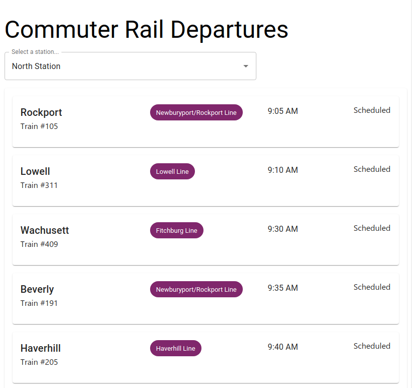

# MBTA Departure board

> Shows live MBTA departure information about a given train station

### Live Demo: <https://mbta-departure-board.vercel.app/>

## Description

This React app uses the [MBTA JSON API](https://www.mbta.com/developers/v3-api) to fetch the current departures of commuter rail stations, including live predictions if the train is on time and what platform it is leaving from (if available).

## Project setup

- [`Create React App`](https://github.com/facebook/create-react-app) for bootstrapping React. This was straight forward for this, I don't need a more complex framework like `next.js`

- [`prettier`](https://prettier.io/) to format code reliably. I have configured my VSCode to automatically format on save.

- [`eslint`](https://eslint.org/) as a linter with some additional configuration for `prettier` and import ordering.

- [`vercel`](https://vercel.com) for deployment. This is an easy setup and allows the app to be deployed automatically after every push.

- [`renovate`](https://www.whitesourcesoftware.com/free-developer-tools/renovate/) dependency bot. This regularly updates all NPM dependencies automatically, which makes maintenance easy.

## Libraries

- [`devour-client`](https://github.com/twg/devour) to consume the MBTA API. Although this is a JS library and doesn't have TypeScript types, it's enough to deserialize the JSON API, which is all I need.

- [`mui`](https://mui.com/) (Material UI for react) as a component library. I just wanted to use some UI components like Inputs and cards to get started quickly.

- [`emotion`](https://emotion.sh/) for CSS styling. I wanted to try out the "CSS-in-JS" with "styled components" approach, which I've never done before. I'm not sure I'm convinced, it makes the components longer and harder to read, but I'd need to see it in a bigger and more complex project.

- [`date-fns`](https://date-fns.org/) for date parsing and formatting, as a more light-weight alternative to `moment.js`

## Next Steps / Possible Improvements

- Update the departure board automatically. The MBTA API supports [streaming](https://www.mbta.com/developers/v3-api/streaming), which could be uses to fetch updates to current predictions. I'm not sure how well that would work with `devour-client`. As an alternative, I would probably start using a minimal state library like [`zustand`](https://github.com/pmndrs/zustand) and fetch data from the API every few seconds

- More detailed information about departures. The API has much more information, like GPS coordinates of stations or specific vehicle information, which could be used to show more details about a specific departure.

- Use an API token. Right now we're just accessing the API without a token, which is enough for these few requests. It would be easy to get an API token, but since this is an SPA, it would be hard to keep that token secure.

- E2E testing. I would use [`Cypress`](https://www.cypress.io/) for that, which I've had pretty good experiences with.
